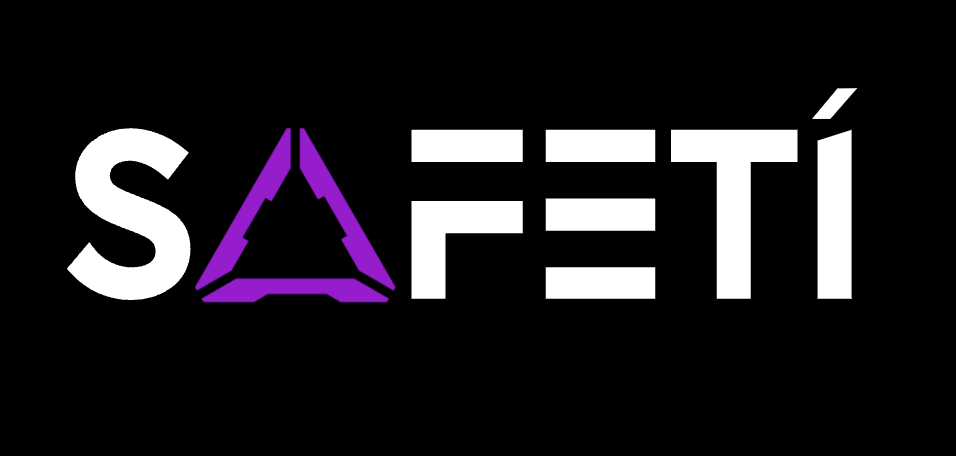

### Description

#### Abstract: Aiding the Irish Rental Crisis with Trustless Computing

The Irish rental market is fraught with challenges. Viewings are rife with bias, Machiavellian competition, price disparities, and pure chance

No solutions exist to balance incentives on both the renter and landlord sides.

Who is behind your project?

We are a team of 4 Irish and Canadian Business Analysts & DeFi Developers. - Steven, Eric, Anthony and Robert.

What is unique about your team?

We are a group of pragmatists who seek to address problems that affect us directly. Our team is composed of diverse professionals with a blend of expertise in blockchain technology, AI, and web2. We are committed to implementing technologies to are practical, real-world solutions that promote fairness and transparency. 

Our personal aggravating experiences with the rental market drive our passion for this Safetí, which ensures our solutions are not only innovative but also grounded in the realities of the issues we aim to solve. Our collaborative approach and interdisciplinary skills enable us to tackle complex challenges effectively, making us well-positioned to tackle these issues. 

What is your solution?

Safetí targets the most sensitive part of the rental process; viewings. The product empowers through:

Blind Bidding Auctions, configured with:
Social Equity Boosted Points.
 Instantly Settled Immutable Matching Transactions
Has this been done before?

No this has not been attempted on these particular nuanced set of technologies nor has a similar solution penetrated the market yet.

Why hasn't this been done already?

The unique combination of 

TEE Hardware Execution Environments.
Fully Encrypted Ethereum.
has not been applied to such a qualitative problem as this, within the rental market
